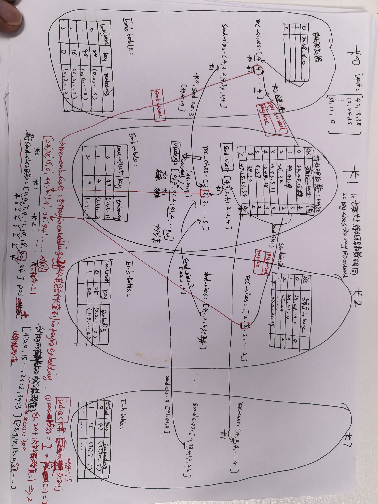

## 1. 输入条件

bs=10   # batchsize的大小为10  
embedding_dim=8  
Iters=15  
local_vocabulary_size=[50, 50]  # 本地词典大小，每张卡？  
all2all_slot=[3, 4]  # 用户有两个特征，每个特征分别有3和4个组合特征值  
num_npus=8 # 有8张卡，即8个worker

解读代码：
[带日志打印的a2a训练代码](../../studying/high-compute/test_a2a_local_with_log.py)

参考日志：
[日志](../../studying/high-compute/test_a2a_local_with_log_logging.txt)

## 2、输入数据生成

```python
# 输入数据
local_indices = []
for i in range(len(all2all_slot)):
    start  = 0
    end =  local_vocabulary_size[i]  
    indices = np.random.randint(start, end, size=(bs, all2all_slot[i]),
                                dtype=np.int64)  # bs: 10   slot: [4, 5]

    local_indices.append(indices)    

# 生成随机二分类标签（用于AUC计算）
local_labels = np.random.randint(0, 2, size=(bs, 1)).astype(np.float32)

# part1
logger.info("=============================================part1==============================================================")

for i, indices in enumerate(local_indices):
    logger.info(f"Slot {i} input indices shape and content======\n {indices.shape}\n dtype: {indices.dtype}\n row:\n {indices}")

```

### 2.1 生成输入数据

特点：范围[0, 50）shape (10, 3) (10, 4)  只生成了30和40个数，这样重复率是低的。

```text
slot0：10 * 3

   [[47 19 38]
   [12 24 15]
   [49 23 41]
   [26 30 43]
   [30 44 26]
   [48 28  5]
   [16  9 47]
   [48 12 37]
   [34 38  3]
   [39 11  0]]

slot1：10 * 4

   [[41 11 16  3]
   [ 2 19 12  1]
   [11 43 17 14]
   [ 7 42 43 46]
   [28 17 23 13]
   [32 12  5 49]
   [31 37 31 25]
   [20 45 16 41]
   [ 8 44  6 22]
   [44 26 19 47]]

 输出的lables：10*1
   [0.]
   [1.]
   [0.]
   [0.]
   [1.]
   [1.]
   [0.]
   [1.]
   [0.]]
```

## 3、embedding表创建

### 3.1 sfps创建表

```python
def create_all2all_embedding_for_every_slot(sfps):
    """
        Note: create_embedding API should not be used mixedly with native api, like remote_embedding, xxx_embedding...
    """

    logger.info("=============================================part2==============================================================")

    for i in range(len(all2all_slot)):  # 两个slot，创建2张表
        init = sfps.Initializer(10, 10, 'constant')  # 表中初始化化值为10
        lrs = sfps.ConstantLR(lr=0.005)
        opt = sfps.Adam(lrs, decay=0.0)
        comm_policy = sfps.communication_policy(communication_type='allreduce', grad_aggregation_type='average')

        feature_policy = sfps.feature_policy('counter_filter_with_default',
                                             counter_threshold=0,
                                             default_key=default_keys[i], shrink_type='step',
                                             shrink_step_threshold=0)

        padding = sfps.padding_param(padding=is_padding, key=padding_key, mask=False)
        feature_completion_param = sfps.feature_completion_param(
            completion=is_completion,
            key=completion_key
        )

        # ---- 新增 logger 记录表信息 ----
        logger.info(
            f"Creating all2all table[{i}]: "
            f"vocab_size={local_vocabulary_size[i]}, emb_dim={embedding_dim}, "
            f"slot_len={all2all_slot[i]}, batch_size={bs}, "
            f"init=constant(10,10), opt=Adam(lr=0.005, decay=0.0), "
            f"comm=allreduce(average), feature_filter=counter_filter, "
            f"default_key={default_keys[i]}, padding={is_padding}(key={padding_key}), "
            f"completion={is_completion}(key={completion_key})"
        )

        sfps.create_table(sfps.c_lib.embedding_type.all2all, local_vocabulary_size[i], embedding_dim,
                          bs, [all2all_slot[i]], opt, init, sfps.c_lib.key_type.int64, sfps.c_lib.pooling_type.sum,
                          sfps.c_lib.hash_type.hash, comm_policy, feature_policy, None) # local_vocabulary_size[i] 大小50

```

代码思考点：

1. sfps层创建的emb table并没有使用， 实际使用的是后面模拟的tf.get_variable创建的emb table。这里会额外占用显存空间吗？  
   不会，主要是在host侧，进行表注册，占用内存。真正占用HBM需要等SFPS初始化/broadcast。
2. Initializer,ConstantLR,Adam 这三个是什么？分别有什么作用？  
   Initializer —— 初始化器 embedding的初始化值  
   ConstantLR —— 学习率调度器 控制训练每一步更新多少即学习率   
   Adam —— 优化器 如何用梯度更新表参数  
3. default key, paddding key, completion key 有什么不同？

   | Key | 补的 id (值) | 触发条件 | Pooling 处理方式 | 建模意图 (具体作用) |
   | :--- | :--- | :--- | :--- | :--- |
   | default_key | -3 | id 低频被过滤 | 计入 (参与 sum/mean) | 给“低频/被过滤”的真 id 兜底 |
   | padding_key | -1 | slot 长度不足 | 排除该位 (sum 不加、mean 分母减 1) | 让缺失不影响结果，“当它不存在” |
   | completion_key | 99 | 特征本身缺失 | 计入该位 (参与 sum/mean) | 让缺失本身成为一个可学特征 |
   
   ```text
   文章A: [标签7, 标签19, 标签3, 标签40]   → 满 4 个
   文章B: [标签7, 标签19]                  → 只有 2 个，后两位缺失
   
   completion_key:
   文章B: [7, 19, 99, 99]
    → 4 位都参与 sum/mean pooling
    → 模型学到"这篇文章标签少"，而不是把后两位直接抹掉(这和padding key 区别)
   ```
日志信息：

```text
2026-06-17 10:39:47,991 - INFO - ===================================part2=================================
2026-06-17 10:39:47,994 - INFO - Creating all2all table[0]: vocab_size=50, emb_dim=8, **slot_len=3, batch_size=10, init=constant(10,10)**, opt=Adam(lr=0.005, decay=0.0), comm=allreduce(average), feature_filter=counter_filter, default_key=-3, padding=False(key=-1), completion=False(key=99)
2026-06-17 10:39:48,007 - INFO - Creating all2all table[1]: vocab_size=50, emb_dim=8, slot_len=4, batch_size=10, init=constant(10,10), opt=Adam(lr=0.005, decay=0.0), comm=allreduce(average), feature_filter=counter_filter, default_key=-3, padding=False(key=-1), completion=False(key=99)
2026-06-17 10:39:48,018 - INFO - sfps.total_embedding_count : 0

```

### 3.2 使用tf的get_variable创建表

#### 3.2.1 create_embeddings

```python
def create_embeddings(vocab_sizes, embedding_dim, slot_vec, conbiner, num_npus, base_table_id, sparse_optimizer, pooling=True):
    # 创建所有embedding tables
    embedding_engines = []
    embedding_tables = []

    logger.info("=============================================part3==============================================================")

    for i, vocab_size in enumerate(vocab_sizes):  #创建表的个数2 即两个slot  [50, 50]
        embEngine = EmbeddingEngine(  # 这才是创建表引擎的核心类
            local_vocab_size=local_vocabulary_size[i],
            embedding_dim=embedding_dim,
            slot_vec=[slot_vec[i]],
            conbiner = conbiner,
            num_npus=num_npus,
            rank=rank,
            table_id=base_table_id+i, # base_table_id 其实起始值0
            sparse_optimizer=sparse_optimizer,
            pooling=pooling
        )

        embedding_tables.append(embEngine.embedding_table)
        embedding_engines.append(embEngine)

        # 从 tf.Variable 中提取名称、形状、数据类型
        var_name = embEngine.embedding_table.name
        var_shape = embEngine.embedding_table.shape
        var_dtype = embEngine.embedding_table.dtype

        logger.info(
            f"Created EmbeddingEngine[{i}]: "
            f"table_id={base_table_id + i}, "
            f"local_vocab_size={local_vocabulary_size[i]}, "
            f"embedding_dim={embedding_dim}, "
            f"slot_vec={slot_vec[i]}, "
            f"conbiner={conbiner}, "
            f"pooling={pooling}, "
            f"embedding_table name={var_name}, " # embedding_table_scope_1_table_0/embedding_table_0:0  0:0是 TensorFlow 变量（tf.Variable）的操作输出索引标记，由 TensorFlow 自动附加，并不是你代码里显式设置
            f"shape={var_shape}, "
            f"dtype={var_dtype}"
        )

    return embedding_tables, embedding_engines

```

日志信息：

```text
2026-06-17 10:39:48,018 - INFO - =======part3========
   2026-06-17 10:39:48,044 - INFO - Created EmbeddingEngine[0]: table_id=0, local_vocab_size=50, embedding_dim=8, slot_vec=3, conbiner=1, pooling=False, embedding_table name=embedding_table_scope_1_table_0/embedding_table_0:0, shape=(50, 8), dtype=<dtype: 'float32_ref'>
   2026-06-17 10:39:48,048 - INFO - Created EmbeddingEngine[1]: table_id=1, local_vocab_size=50, embedding_dim=8, slot_vec=4, conbiner=1, pooling=False, embedding_table name=embedding_table_scope_1_table_1/embedding_table_1:0, shape=(50, 8), dtype=<dtype: 'float32_ref'>

```

#### 3.2.2 EmbeddingEngine中tf.get_variable模拟构造emb表-构造函数

````
class EmbeddingEngine:
    def __init__(self, local_vocab_size, embedding_dim, slot_vec, conbiner, num_npus, rank, table_id, sparse_optimizer, pooling=True):
        self.table_id = table_id
        self.local_vocab_size = local_vocab_size  # 本地嵌入表最大容量
        self.embedding_dim = embedding_dim        # 嵌入维度
        self.num_npus = num_npus                  # 总卡数
        self.rank = rank                          # 当前卡序号
        self.slot_vec = slot_vec
        self.conbiner = conbiner
        self.sparse_optimizer = sparse_optimizer
        self.pooling = pooling   # True: 返回聚合后的向量；False: 返回原始序列

        # 用于保存中间张量，便于运行时打印
        self.debug_tensors = {}

        # # 初始化独立嵌入表（tf.Variable）
        with tf.variable_scope(f"embedding_table_scope_{rank}_table_{self.table_id}"):   # 变量的名字/之前的部分
            self.embedding_table = tf.get_variable(
                f'embedding_table_{self.table_id}',
                shape=[self.local_vocab_size, embedding_dim],            # [50, 8]
                initializer=tf.constant_initializer(value=rank), # 自定义常量值, 使用card的id赋额初始值，目的是后面的示例数据，有区分
                # initializer=tf.random_uniform_initializer(minval=-1.0, maxval=1.0, seed=1234),                   
                dtype=tf.float32
            )
````

说明：

1. 这个变量什么时候落HBM？ 当执行`sess.run(tf.compat.v1.global_variables_initializer())` 真正落到HBM。另外，用户定义的全局变量（通过 `tf.get_variable` 或 `tf.Variable` `tf.layers.dense`创建）可以通过`tf.global_variables()`获取，通过name进行分类统计。
2. 初始化的`EmbeddingEngine`中`embedding_table`：name：embedding_table_scope_0_table_0/embedding_table_0 shape：50 * 8   用rank进行初始化，当rank=1时：
   
   ```text
   [[1. 1. 1. 1. 1. 1. 1. 1.]
   [1. 1. 1. 1. 1. 1. 1. 1.]
   [1. 1. 1. 1. 1. 1. 1. 1.]
   [1. 1. 1. 1. 1. 1. 1. 1.]
   ....
   [1. 1. 1. 1. 1. 1. 1. 1.]
   [1. 1. 1. 1. 1. 1. 1. 1.]
   [1. 1. 1. 1. 1. 1. 1. 1.]
   [1. 1. 1. 1. 1. 1. 1. 1.]]
   ```
3. 迭代第1轮后：`EmbeddingEngine`中`embedding_table` 内容? 为什么？后面分析
   
   ```text
   name：embedding_table_scope_0_table_0/embedding_table_0  50 * 8
   [[0.995 1.005 1.005 1.005 0.995 1.005 0.995 0.995]
   [0.995 1.005 1.005 1.005 0.995 1.005 0.995 0.995]
   [0.995 1.005 1.005 1.005 0.995 0.995 0.995 0.995]
   [1.    1.    1.    1.    1.    1.    1.    1.   ]
   [1.    1.    1.    1.    1.    1.    1.    1.   ]
   [1.    1.    1.    1.    1.    1.    1.    1.   ]
   ...
   ]
   ```
   
   ```text
   name：embedding_table_scope_0_table_1/embedding_table_1  50 * 8
   [[0.995 1.005 1.005 0.995 0.995 1.005 0.995 0.995]
   [0.995 1.005 1.005 1.005 0.995 1.005 1.005 0.995]
   [0.995 0.995 0.995 0.995 1.005 1.005 0.995 0.995]
   [1.005 0.995 0.995 0.995 1.005 0.995 0.995 1.005]
   [0.995 0.995 0.995 0.995 1.005 1.005 0.995 0.995]
   [1.    1.    1.    1.    1.    1.    1.    1.   ]
   [1.    1.    1.    1.    1.    1.    1.    1.   ]
   [1.    1.    1.    1.    1.    1.    1.    1.   ]
   [1.    1.    1.    1.    1.    1.    1.    1.   ]
   ...
   ]
   
   ```

## 4. DCN 模型

### 4.1 DCN前向

输入模型dcn_model的数据shape：`batch_embedding`  shape为：[10  7  8]   即两个slot：(10,3,8) (10,4,8) concat后结果

#### 4.1.1 lookup_and_gather

`def lookup_and_gather(self, input_ids)` 处理逻辑：

```python
def lookup_and_gather(self, input_ids):
    """完整查询流程（基于动态offset）"""
    # 步骤1：去重并准备发送ID 
    # 步骤2：All2All交换ID
    # 步骤3：本地查询（基于动态offset）    
    self.send_sizes, self.recv_sizes, self.indices, self.uindex, offset_count = \
        _key_process(input_ids, self.table_id, slot_size=self.slot_vec[0],  # slot_vec=[3] 或 [4] 所以self.slot_vec[0]就是某个slot中特征值的个数
                     name_=f'keyprocess{self.table_id}', is_prefetch_=False,
                     npu_num_=self.num_npus, cap_=self.local_vocab_size)
    
    # ---------- 保存中间张量用于运行时打印 ----------
    self.debug_tensors['offset_count'] = offset_count
    self.debug_tensors['uindex0'] = self.uindex 
    
    self.uindex = self.uindex[:offset_count]
 
    all_recv_embeds = tf.nn.embedding_lookup(self.embedding_table, self.uindex)
    
    
    # 步骤4： embedding all2all 
    send_embedding_sizes = self.recv_sizes * self.embedding_dim
    recv_embedding_sizes =  self.send_sizes * self.embedding_dim 
    # alltoallv_exchange_sizes(send_embedding_sizes, self.num_npus)                                         
    
    recv_embeds_list = alltoallv_exchange_embeddings(
                all_recv_embeds,
                send_embedding_sizes,
                recv_embedding_sizes
    )
    
    recv_embeds_list = tf.reshape(recv_embeds_list, [-1, self.embedding_dim])
    
    
    # # 步骤6 gather 
    
    restored_embeddings = tf.gather(recv_embeds_list, self.indices)  # shape: [30, 8]
    final_restored = tf.reshape(restored_embeddings, [bs, -1, self.embedding_dim]) #shape: [10,3,8] 
    
    # ---------- 保存中间张量用于运行时打印 ----------
    self.debug_tensors['send_sizes'] = self.send_sizes
    self.debug_tensors['recv_sizes'] = self.recv_sizes
    self.debug_tensors['indices'] = self.indices
    self.debug_tensors['uindex'] = self.uindex
    self.debug_tensors['all_recv_embeds'] = all_recv_embeds
    self.debug_tensors['recv_embeds_list'] = recv_embeds_list
    self.debug_tensors['final_restored'] = final_restored
    
    if self.pooling:
        # 池化模式：按 slot 聚合（原有逻辑）
        cum_sizes = [0]
        current = 0
        for size in self.slot_vec:
            current += size
            cum_sizes.append(current)
        starts = cum_sizes[:-1] # 起始索引：[0,1,3]
        ends = cum_sizes[1:] # 结束索引：[1,3,6]
    
        slot_aggs = []
        for s, e in zip(starts, ends):
            slot = final_restored[:, s:e, :] # 形状：[bs, slot_len, dim]
            if self.conbiner == 0:
                slot_aggs.append(tf.reduce_sum(slot, axis=1))
            else:
                slot_aggs.append(tf.reduce_mean(slot, axis=1))
        result = tf.stack(slot_aggs, axis=1)   # [bs, num_slots, dim]
    else:
        # 非池化模式：直接返回序列
        result = final_restored                # [bs, total_slot_len, dim]
    
    return restored_embeddings, result

```

关键代码点说明：

1. _key_process: 提供的能力？
   * 去重：得到唯一 key 列表
   * 分区：按 key % num_npus 计算每个 key 的目标卡。
   * 通信准备：
     统计发往各卡的去重 key 数量 → send_sizes
     通过 All‑to‑All 交换 size，得到从各卡接收的数量 → recv_sizes
     再将实际 key（或 key 对应的本地索引）通过 All‑to‑All 发送给目标卡，各卡收到后排列成自己的 uindex（本地偏移）。
   * 生成逆映射：indices
     对于原始输入中的每一个 key（包括重复），在去重后的唯一 key 集合中找到它的位置，再结合通信后的排列规则，计算出它在最终接收缓冲区 recv_embeds_list 中的索引，这个结果就是 indices。
     因此，indices 的长度始终等于原始 key 的总数（30），每个元素都是 recv_embeds_list 中的一个合法索引，这样就完美建立了从“打乱的通信结果”回到“原始输入顺序”的桥梁。

#### 4.1.2 _key_process

`input_ids`:   slot0：10 * 3  总共30个key，有24个不同的key，重复率：1-24/30=0.2
[[47 19 38]
[12 24 15]
[49 23 41]
[26 30 43]
[30 44 26]
[48 28  5]
[16  9 47]
[48 12 37]
[34 38  3]
[39 11  0]]

##### 手动计算

1） 对card1上的slot0的`input_ids`数据，分区和去重结果如下：key%8

| 分区（目标卡） | 原始 key（去重前） | 去重后唯一 key | 唯一个数 |
|---------------|---------------------|----------------|----------|
| 0             | 24, 48, 16, 48, 0    |  24, 48, 16, 0   | 4        |
| 1             | 49, 41, 9            | 49, 41, 9     | 3        |
| 2             | 26, 26, 34           | 26, 34        | 2        |
| 3             | 19, 43, 3, 11        | 19, 43, 3, 11   | 4        |
| 4             | 12, 44, 28, 12       | 12, 44, 28   | 3        |
| 5             | 5, 37                | 5, 37          | 2        |
| 6             | 38, 30, 30, 38       | 38, 30      | 2        |
| 7             | 47, 15, 23, 47, 39   | 47, 15, 23, 39 | 4        |

2）uindex,offset,send_sizes, rec_sizes, indices



##### 实测日志和数据分析

lookup_and_gather计算过程，根据生成的debug_tensors信息依次分析如下:

```text
Iter 0 Engine table_id=0 forward/backward intermediates:

   offset_count: 24
   uindex0: shape=(50,), dtype=int32
   uindex0: [ 0  1  2  0  1  2  0  1  2  0  1  2  0  1  2  0  1  2  0  1  2  0  1  2
   -1 -1  0  0 -1 -1  0  0 -1 -1  0  0 -1 -1  0  0 -1 -1  0  0 -1 -1  0  0 -1 -1]

```

数据分析：
**offset_count分析**: offset_count=24 表示有效接收的 key 数量为 24，之后取 uindex = uindex0[:24]。
这个 24 长度的序列正是从 8 个源卡各接收 3 个 key，映射到本地 offset 的结果。因为本卡负责的 3 个唯一 key（49, 41, 9）被映射成了本地偏移 0, 1, 2（可能按排序规则），所以出现了 0,1,2 循环 8 次。

**uindex分析**: shape=(24,), dtype=int32  [0 1 2 0 1 2 0 1 2 0 1 2 0 1 2 0 1 2 0 1 2 0 1 2]
这个 24 长度的序列正是从 8 个源卡各接收 3 个 key（8个源卡上数据是一样的），映射到本地 offset 的结果。因为本卡负责的 3 个唯一 key（49, 41, 9）被映射成了本地偏移 0, 1, 2，所以出现了 0,1,2 循环 8 次。  
这24个数据在本卡上查询embedding，查到到后通过all2all emb将结果返给其它卡。

```text
send_sizes: shape=(8,), dtype=int64
send_sizes: [4 3 2 4 3 2 2 4]

recv_sizes: shape=(8,), dtype=int64
recv_sizes: [3 3 3 3 3 3 3 3]
```

**send_sizes分析**：含义: 本卡向其它卡请求的key的size数量，参考上面手动计算的表格部分

**recv_sizes分析**：
含义：其它卡向本卡请求的key的size的数量。
分区规则：key % num_npus，当前 num_npus=8，本卡 rank=1，所以本卡负责 所有 key % 8 == 1 的 key。
全局唯一 key：在你的输入数据中，属于分区 1 的唯一 key 只有三个：49, 41, 9 所有卡的输入数据完全相同：每张 NPU 的输入矩阵都是一模一样的 10×3 数组。
也可以参考手动计算图片中的内容。

**为什么需要keysize的all2all？** 
uindex中从本地查到相应的数据后，发送到其它各张卡上的embedding。  
如果没有recv_sizes，仅有其他卡向本卡请求的key列表，那么在本卡查到embedding后，向其它卡发送几个key的embedding是不知道的。

**all_recv_embeds分析：**

```text
all_recv_embeds: shape=(24, 8), dtype=float32
   all_recv_embeds: [[1. 1. 1. 1. 1. 1. 1. 1.]
   [1. 1. 1. 1. 1. 1. 1. 1.]
   [1. 1. 1. 1. 1. 1. 1. 1.]
   [1. 1. 1. 1. 1. 1. 1. 1.]
   [1. 1. 1. 1. 1. 1. 1. 1.]
   [1. 1. 1. 1. 1. 1. 1. 1.]
   [1. 1. 1. 1. 1. 1. 1. 1.]
   [1. 1. 1. 1. 1. 1. 1. 1.]
   [1. 1. 1. 1. 1. 1. 1. 1.]
   [1. 1. 1. 1. 1. 1. 1. 1.]
   [1. 1. 1. 1. 1. 1. 1. 1.]
   [1. 1. 1. 1. 1. 1. 1. 1.]
   [1. 1. 1. 1. 1. 1. 1. 1.]
   [1. 1. 1. 1. 1. 1. 1. 1.]
   [1. 1. 1. 1. 1. 1. 1. 1.]
   [1. 1. 1. 1. 1. 1. 1. 1.]
   [1. 1. 1. 1. 1. 1. 1. 1.]
   [1. 1. 1. 1. 1. 1. 1. 1.]
   [1. 1. 1. 1. 1. 1. 1. 1.]
   [1. 1. 1. 1. 1. 1. 1. 1.]
   [1. 1. 1. 1. 1. 1. 1. 1.]
   [1. 1. 1. 1. 1. 1. 1. 1.]
   [1. 1. 1. 1. 1. 1. 1. 1.]
   [1. 1. 1. 1. 1. 1. 1. 1.]]

```
查询本地 embedding_table获取，因为用 rank=1 初始化，所有行的值均为 1。
all_recv_embeds = tf.nn.embedding_lookup(table, uindex)，uindex 取值为 0,1,2即本地表索引，对应的嵌入都是 [1,1,...,1]。因此得到 24×8 的全 1 矩阵

**recv_embeds_list数据分析：**

```text
recv_embeds_list: shape=(24, 8), dtype=float32
recv_embeds_list: [[0. 0. 0. 0. 0. 0. 0. 0.]
   [0. 0. 0. 0. 0. 0. 0. 0.]
   [0. 0. 0. 0. 0. 0. 0. 0.]
   [0. 0. 0. 0. 0. 0. 0. 0.]
   [1. 1. 1. 1. 1. 1. 1. 1.]
   [1. 1. 1. 1. 1. 1. 1. 1.]
   [1. 1. 1. 1. 1. 1. 1. 1.]
   [2. 2. 2. 2. 2. 2. 2. 2.]
   [2. 2. 2. 2. 2. 2. 2. 2.]
   [3. 3. 3. 3. 3. 3. 3. 3.]
   [3. 3. 3. 3. 3. 3. 3. 3.]
   [3. 3. 3. 3. 3. 3. 3. 3.]
   [3. 3. 3. 3. 3. 3. 3. 3.]
   [4. 4. 4. 4. 4. 4. 4. 4.]
   [4. 4. 4. 4. 4. 4. 4. 4.]
   [4. 4. 4. 4. 4. 4. 4. 4.]
   [5. 5. 5. 5. 5. 5. 5. 5.]
   [5. 5. 5. 5. 5. 5. 5. 5.]
   [6. 6. 6. 6. 6. 6. 6. 6.]
   [6. 6. 6. 6. 6. 6. 6. 6.]
   [7. 7. 7. 7. 7. 7. 7. 7.]
   [7. 7. 7. 7. 7. 7. 7. 7.]
   [7. 7. 7. 7. 7. 7. 7. 7.]
   [7. 7. 7. 7. 7. 7. 7. 7.]]

```

这是 All‑to‑All 交换嵌入后的接收缓冲区，排列顺序与 send_sizes 一致（按源卡 0‑7 的顺序接收）。
由于各卡的表初始化为各自的 rank：
卡0 发来 4 个嵌入 → 4 个 [0,…,0]
卡1 发来 3 个嵌入 → 3 个 [1,…,1]（本卡发给自己的也是 1）
卡2 发来 2 个嵌入 → 2 个 [2,…,2]
卡3 发来 4 个嵌入 → 4 个 [3,…,3]
卡4 发来 3 个嵌入 → 3 个 [4,…,4]
卡5 发来 2 个嵌入 → 2 个 [5,…,5]
卡6 发来 2 个嵌入 → 2 个 [6,…,6]
卡7 发来 4 个嵌入 → 4 个 [7,…,7]

内部是按照首次出现顺序排列，和indices规则对齐，所以可以通过indices和recv_embeds_list 恢复30个key的embedding。

**indices分析：**

```text
indices: shape=(30,), dtype=int64
indices: [20  9 18 13  0 21  4 22  5  7 19 10 19 14  7  1 15 16  2  6 20  1 13 17  8 18 11 23 12  3]

```

原始 key 序列（30个），去重后有 24 个唯一 key
各卡唯一 key 数量（即 send_sizes）：[4,3,2,4,3,2,2,4]。
posOffset_ = [0, 4, 7, 9, 13, 16, 18, **20**, 24]。
卡7上内部偏移量：{47:0, 15:1,23:2, 39:3}
对于key=15：deviceId=7，是卡7的第2个唯一key，pos=1 → 全局索引 = 20+1=21
另外，indices就是 recv_embeds_list 的下标，也就是：按照分区时的顺序返回回来。

**final_restored数据分析：**


```text
final_restored: shape=(10, 3, 8), dtype=float32
final_restored:
[[[7. 7. 7. 7. 7. 7. 7. 7.]
[3. 3. 3. 3. 3. 3. 3. 3.]
[6. 6. 6. 6. 6. 6. 6. 6.]]

[[4. 4. 4. 4. 4. 4. 4. 4.]
[0. 0. 0. 0. 0. 0. 0. 0.]
[7. 7. 7. 7. 7. 7. 7. 7.]]

[[1. 1. 1. 1. 1. 1. 1. 1.]
[7. 7. 7. 7. 7. 7. 7. 7.]
[1. 1. 1. 1. 1. 1. 1. 1.]]

[[2. 2. 2. 2. 2. 2. 2. 2.]
[6. 6. 6. 6. 6. 6. 6. 6.]
[3. 3. 3. 3. 3. 3. 3. 3.]]

[[6. 6. 6. 6. 6. 6. 6. 6.]
[4. 4. 4. 4. 4. 4. 4. 4.]
[2. 2. 2. 2. 2. 2. 2. 2.]]

[[0. 0. 0. 0. 0. 0. 0. 0.]
[4. 4. 4. 4. 4. 4. 4. 4.]
[5. 5. 5. 5. 5. 5. 5. 5.]]

[[0. 0. 0. 0. 0. 0. 0. 0.]
[1. 1. 1. 1. 1. 1. 1. 1.]
[7. 7. 7. 7. 7. 7. 7. 7.]]

[[0. 0. 0. 0. 0. 0. 0. 0.]
[4. 4. 4. 4. 4. 4. 4. 4.]
[5. 5. 5. 5. 5. 5. 5. 5.]]

[[2. 2. 2. 2. 2. 2. 2. 2.]
[6. 6. 6. 6. 6. 6. 6. 6.]
[3. 3. 3. 3. 3. 3. 3. 3.]]

[[7. 7. 7. 7. 7. 7. 7. 7.]
[3. 3. 3. 3. 3. 3. 3. 3.]
[0. 0. 0. 0. 0. 0. 0. 0.]]]

```

indices 长度 30，每个元素指定了原始输入 key 在 recv_embeds_list 中的索引。
例如，输入第一行 [47, 19, 38] 对应 indices[0]=20, indices[1]=9, indices[2]=18：
recv_embeds_list[20] = [7....]
recv_embeds_list[9] = [3...]
recv_embeds_list[18] = [6...]


#### 4.1.3 alltoallv_exchange_embeddings

```python

@tf.custom_gradient
def alltoallv_exchange_embeddings(send_tensors, send_sizes, recv_sizes):
    """通过hccl_ops.all_to_all_v交换实际数据（支持动态大小）"""
	"""
  send_tensors：
  all_recv_embeds: shape=(24, 8), dtype=float32
  all_recv_embeds: [[1. 1. 1. 1. 1. 1. 1. 1.]
  [1. 1. 1. 1. 1. 1. 1. 1.]
  [1. 1. 1. 1. 1. 1. 1. 1.]
  [1. 1. 1. 1. 1. 1. 1. 1.]
  [1. 1. 1. 1. 1. 1. 1. 1.]
  [1. 1. 1. 1. 1. 1. 1. 1.]
  [1. 1. 1. 1. 1. 1. 1. 1.]
  [1. 1. 1. 1. 1. 1. 1. 1.]
  [1. 1. 1. 1. 1. 1. 1. 1.]
  [1. 1. 1. 1. 1. 1. 1. 1.]
  [1. 1. 1. 1. 1. 1. 1. 1.]
  [1. 1. 1. 1. 1. 1. 1. 1.]
  [1. 1. 1. 1. 1. 1. 1. 1.]
  [1. 1. 1. 1. 1. 1. 1. 1.]
  [1. 1. 1. 1. 1. 1. 1. 1.]
  [1. 1. 1. 1. 1. 1. 1. 1.]
  [1. 1. 1. 1. 1. 1. 1. 1.]
  [1. 1. 1. 1. 1. 1. 1. 1.]
  [1. 1. 1. 1. 1. 1. 1. 1.]
  [1. 1. 1. 1. 1. 1. 1. 1.]
  [1. 1. 1. 1. 1. 1. 1. 1.]
  [1. 1. 1. 1. 1. 1. 1. 1.]
  [1. 1. 1. 1. 1. 1. 1. 1.]
  [1. 1. 1. 1. 1. 1. 1. 1.]]
send_embedding_sizes = self.recv_sizes * embedding_dim = [24, 24, 24, 24, 24, 24, 24, 24]   其实就是本地查询后，发给其它卡的sizes
recv_embedding_sizes = self.send_sizes * embedding_dim = [32, 24, 16, 32, 24, 16, 16, 32]  从其它卡获取到的key的sizes
	"""

    recv_sizes = tf.ensure_shape(recv_sizes, (None,))

    # 发送配置：计算发送计数和偏移量（前缀和）
    send_counts = tf.cast(send_sizes, tf.int64)
    send_displacements = tf.cumsum(tf.concat([[0], tf.cast(send_sizes[:-1], tf.int64)], axis=0))

	'''
 	send_counts = tf.cast(send_embedding_sizes, tf.int64)
  	= [24, 24, 24, 24, 24, 24, 24, 24]

   send_displacements = cumsum( [0, send_embedding_sizes[:-1]] )  #[:-1]取前7个，最后1个不要
   = cumsum( [0, 24, 24, 24, 24, 24, 24, 24] )
   = [0, 24, 48, 72, 96, 120, 144, 168]

	含义：当前卡（rank=1）将 all_recv_embeds（共 192 个浮点数，按行展平）平均分为 8 段，每段 24 个元素（即 3 个key的embedding），依次发送给 rank 0～7。
              也是就是需要从当前卡上获取embedding，发送到其它卡上。
	'''

    # 接收配置：计算接收缓冲区大小和偏移量
    recv_total = tf.reduce_sum(recv_sizes)
    recv_buf = tf.zeros([recv_total], dtype=tf.float32)  # 预分配接收缓冲区
    recv_counts = tf.cast(recv_sizes, tf.int64)
    recv_displacements = tf.cumsum(tf.concat([[0], tf.cast(recv_sizes[:-1], tf.int64)], axis=0))

	'''
	recv_total = tf.reduce_sum(recv_embedding_sizes) = 32+24+16+32+24+16+16+32 = 192

	recv_buf = 预分配的形状为 [192] 的零张量，用于接收通信结果。

	recv_counts = tf.cast(recv_embedding_sizes, tf.int64)
	= [32, 24, 16, 32, 24, 16, 16, 32]

	recv_displacements = cumsum( [0, recv_embedding_sizes[:-1]] )
	计算步骤：
	recv_embedding_sizes[:-1] = [32, 24, 16, 32, 24, 16, 16]
	拼接 0 后 = [0, 32, 24, 16, 32, 24, 16, 16]
	累加和 = [0, 32, 56, 72, 104, 128, 144, 160]

	含义：从 8 个源卡分别接收不同数量的浮点数（对应各卡发送给本卡的去重 key 的嵌入），总接收 192 个值，依次存放在 recv_buf 的对应偏移处。
	'''

    # 执行HCCL all_to_all_v数据交换
    recv_buf = hccl_ops.all_to_all_v(
        send_data=send_tensors,
        send_counts=send_counts,
        send_displacements=send_displacements,
        recv_counts=recv_counts,
        recv_displacements=recv_displacements
    )
	'''
	hccl_ops.all_to_all_v 将按照上述 send_counts / send_displacements 把本地的 all_recv_embeds 分段发给各卡，同时按 recv_counts / recv_displacements 从各卡收集数据，填充 recv_buf 并返回。之后 recv_buf 被 reshape 为 [24, 8]，即日志中的 recv_embeds_list（排列顺序为卡0的4个嵌入、卡1的3个、卡2的2个…卡7的4个）
	'''

    # 梯度函数：all-to-all的逆操作 实现梯度对称回传

    def grad(upstream_grad):
        grad_send = hccl_ops.all_to_all_v(
            send_data=upstream_grad,
            send_counts=recv_counts,
            send_displacements=recv_displacements,
            recv_counts=send_counts,
            recv_displacements=send_displacements
        )
        return grad_send, None, None  
        # 三个返回对应三个输入（send_tensors、send_sizes、recv_sizes），后两者是 size 配置不需梯度，故返回 None

    return  recv_buf, grad

```

##### 1. all_to_all_v 的接口两个参数说明
   
| 参数                   | 含义                                                   | 补充说明                                                          |
| ------------------------ | -------------------------------------------------------- | ------------------------------------------------------------------- |
| `counts[i]`        | 第 i 段有多少个元素                                    | 表示第 i 段的数据长度                                             |
| `displacements[i]` | 第 i 段在缓冲区里的起始下标                            | 该段的起始位置                                                    |
| 一段数据的范围         | `[displacements[i], displacements[i] + counts[i])` | 左闭右开区间，结束位置由 `counts[i]` 决定，无需额外的结束下标 |
   
   以上面的为例：
   
   recv_sizes = [32, 24, 16, 32, 24, 16, 16, 32]，recv_total = 192：
   recv_displacements = cumsum([0, 32, 24, 16, 32, 24, 16, 16]) = [0, 32, 56, 72, 104, 128, 144, 160] # 8 个值
   对应 8 张卡 各段在 recv_buf 中的布局：
   卡0: [0, 32) count=32
   卡1: [32, 56) count=24
   卡2: [56, 72) count=16
   卡3: [72, 104) count=32
   卡4: [104, 128) count=24
   卡5: [128, 144) count=16
   卡6: [144, 160) count=16
   卡7: [160, 192) count=32 ← 160 + 32 = 192
   如果仅有sizes，没有displacements，不方便计算。

##### 2. `@tf.custom_gradient` 修饰？里面的 `grad` 什么时候调用？

`@tf.custom_gradient` 用来给「框架不知道怎么求导」的算子手动挂上反向规则。本函数包装的是 `hccl_ops.all_to_all_v`，属于纯通信算子，没有内置梯度。

###### 2.1 函数约定（对照代码）

```python
@tf.custom_gradient
def alltoallv_exchange_embeddings(send_tensors, send_sizes, recv_sizes):
    # ... 计算 send/recv counts、displacements ...
    recv_buf = hccl_ops.all_to_all_v(...)   # 前向：交换 embedding

    def grad(upstream_grad):
        grad_send = hccl_ops.all_to_all_v(  # 反向：配置互换后再 all_to_all_v
            send_data=upstream_grad,
            send_counts=recv_counts,
            send_displacements=recv_displacements,
            recv_counts=send_counts,
            recv_displacements=send_displacements
        )
        return grad_send, None, None  # 对应三个输入的梯度

    return recv_buf, grad
```

要点：

| 写法 | 实际含义 |
|------|----------|
| `return recv_buf, grad` | 装饰器拦截该元组：`recv_buf` 挂到计算图；`grad` 注册为反向钩子 |
| 调用方 `x = alltoallv_exchange_embeddings(...)` | Python 侧**只拿到** `recv_buf` 这一个张量，拿不到 `grad` |
| `return grad_send, None, None` | 三个返回值分别对应三个输入；`send_sizes` / `recv_sizes` 是通信配置，不需要梯度 |

###### 2.2 为什么需要它？（通用机制）

* `hccl_ops.all_to_all_v` 没有注册梯度；若不包装，自动微分在这里会断掉。
* `custom_gradient` 同时定义：**前向输出** + **如何从输出梯度反推输入梯度**。
* 核心设计是 **send ↔ recv 配置互换**：
  * **前向**：按 `send_*` 把本地 `send_tensors` 分发给各卡，按 `recv_*` 收成 `recv_buf`。
  * **反向**：把 `upstream_grad`（∂L/∂recv_buf）当数据，用原来的 `recv_*` 当发送配置、`send_*` 当接收配置，把梯度原路送回，得到 `grad_send`（∂L/∂send_tensors）。

这是 All-to-All 可逆性的直接体现：正向按某布局发出去，反向按对称布局收回来。

###### 2.3 `grad` 何时会被框架调用？（通用机制）

`@tf.custom_gradient` 只是在计算图上挂了一条反向规则。框架**不会**在前向 `all_to_all_v` 时调用 `grad`；只有自动微分需要「穿过这个算子、求对输入 `send_tensors` 的梯度」时才会调用。


假设写成：

```python
tf.gradients(loss, all_recv_embeds)
# 或 compute_gradients(loss, embedding_table)
```

反向路径必须穿过前向那次 all2all：

```text
embedding_table
    → embedding_lookup → all_recv_embeds          ← all2all 的输入send_tensors，穿过，会自动调用
    → alltoallv_exchange_embeddings → recv_buf
    → gather → restored_embeddings                ← 本文件求梯度的终点
    → reshape → DCN → loss
```

这时 `grad(upstream_grad)` 才会跑，内部用 send/recv 互换再做一次 `all_to_all_v`。

###### 2.4 本文件实际怎么走？（没有穿过前向 all2all）

本文件稀疏反求的目标不是 `all_recv_embeds`，而是 all2all **之后**、`gather` 得到的 `restored_embeddings`：

```python
sparse_grads = sparse_optimizer.compute_gradients(
    loss, all2all_embeddings_before_gather)  # 即 restored_embeddings
```

自动微分只需要算到这里就停：

```text
embedding_table
    → embedding_lookup → all_recv_embeds          ← all2all 的输入 send_tensors
    → alltoallv_exchange_embeddings → recv_buf
    → gather → restored_embeddings                ← 本文件求梯度的终点
    → reshape → DCN → loss
```


因为不需要 ∂L/∂send_tensors，框架就**没有理由**调用 `grad`。

跨卡把梯度送回持有 embedding 的卡，是后面 **手动**做的：

```text
① 前向 lookup_and_gather：
   all_recv_embeds → alltoallv_exchange_embeddings → recv_embeds_list
   → gather → restored_embeddings  （记入 all2all_embeddings_before_gather）

② 求稀疏梯度（停在 restored_embeddings，不再往前穿 all2all）：
   sparse_grads = sparse_optimizer.compute_gradients(
       loss, all2all_embeddings_before_gather)

③ 手动反向 embedding_engines[i].backward(grad)：
   对 indices 做 unsorted_segment_sum（相当于 gather 的逆）
   → 再调用一次 alltoallv_exchange_embeddings（用的是其【前向】路径）
   → 二次聚合后 apply_gradients 更新 embedding_table
```
相关代码如下：
```python
  sparse_grads = sparse_optimizer.compute_gradients(loss, all2all_embeddings_before_gather)
    ...
      grad, var = sparse_grads[i] 
      updated_table = embedding_engines[i].backward(grad)
```


###### 2.5 小结

* **机制层面**：`@tf.custom_gradient` + send/recv 互换，是让 all2all 可微的标准写法，解释本身合理。
* **本工程层面**：稀疏 embedding 的跨卡梯度回传，主要靠 `backward()` 里第二次 `alltoallv_exchange_embeddings`（前向路径）完成，而不是靠装饰器注册的 `grad`。
* 两者数学上等价（都是配置互换的 all2all）；差别只是「自动微分触发」还是「手动再调一次」。

### 4.2 DCN模型

#### 4.2.1 DCN模型-调用点

```python

all2all_embeddings  # 是有2个元素的list： [10,3,8] [10,4,8]
...
all2all_embedding = tf.concat(all2all_embeddings, axis=1) # [10, 7, 8]
batch_embedding = all2all_embedding
logger.info(f"batch_embedding static shape: {batch_embedding.shape}")
loss, logits = dcn_model(batch_embedding, label_placeholder, is_pooling=use_pooling_in_pull)  # dcn模型的输入：[10,7,8]

```

DCN模型的输入：通过上面`lookup_and_gather`函数中的：  `final_restored` 作为result返回，获取。日志实测为：

```text
slot0-   final_restored: 
[[[7. 7. 7. 7. 7. 7. 7. 7.]
  [3. 3. 3. 3. 3. 3. 3. 3.]
  [6. 6. 6. 6. 6. 6. 6. 6.]]

 [[4. 4. 4. 4. 4. 4. 4. 4.]
  [0. 0. 0. 0. 0. 0. 0. 0.]
  [7. 7. 7. 7. 7. 7. 7. 7.]]

 [[1. 1. 1. 1. 1. 1. 1. 1.]
  [7. 7. 7. 7. 7. 7. 7. 7.]
  [1. 1. 1. 1. 1. 1. 1. 1.]]

 [[2. 2. 2. 2. 2. 2. 2. 2.]
  [6. 6. 6. 6. 6. 6. 6. 6.]
  [3. 3. 3. 3. 3. 3. 3. 3.]]

 [[6. 6. 6. 6. 6. 6. 6. 6.]
  [4. 4. 4. 4. 4. 4. 4. 4.]
  [2. 2. 2. 2. 2. 2. 2. 2.]]

 [[0. 0. 0. 0. 0. 0. 0. 0.]
  [4. 4. 4. 4. 4. 4. 4. 4.]
  [5. 5. 5. 5. 5. 5. 5. 5.]]

 [[0. 0. 0. 0. 0. 0. 0. 0.]
  [1. 1. 1. 1. 1. 1. 1. 1.]
  [7. 7. 7. 7. 7. 7. 7. 7.]]

 [[0. 0. 0. 0. 0. 0. 0. 0.]
  [4. 4. 4. 4. 4. 4. 4. 4.]
  [5. 5. 5. 5. 5. 5. 5. 5.]]

 [[2. 2. 2. 2. 2. 2. 2. 2.]
  [6. 6. 6. 6. 6. 6. 6. 6.]
  [3. 3. 3. 3. 3. 3. 3. 3.]]

 [[7. 7. 7. 7. 7. 7. 7. 7.]
  [3. 3. 3. 3. 3. 3. 3. 3.]
  [0. 0. 0. 0. 0. 0. 0. 0.]]]

slot1-   final_restored: 
    [[[1. 1. 1. 1. 1. 1. 1. 1.] 
     [3. 3. 3. 3. 3. 3. 3. 3.]
     [0. 0. 0. 0. 0. 0. 0. 0.]
     [3. 3. 3. 3. 3. 3. 3. 3.]]

    [[2. 2. 2. 2. 2. 2. 2. 2.]
     [3. 3. 3. 3. 3. 3. 3. 3.]
     [4. 4. 4. 4. 4. 4. 4. 4.]
     [1. 1. 1. 1. 1. 1. 1. 1.]]

    [[3. 3. 3. 3. 3. 3. 3. 3.]
     [3. 3. 3. 3. 3. 3. 3. 3.]
     [1. 1. 1. 1. 1. 1. 1. 1.]
     [6. 6. 6. 6. 6. 6. 6. 6.]]

    [[7. 7. 7. 7. 7. 7. 7. 7.]
     [2. 2. 2. 2. 2. 2. 2. 2.]
     [3. 3. 3. 3. 3. 3. 3. 3.]
     [6. 6. 6. 6. 6. 6. 6. 6.]]

    [[4. 4. 4. 4. 4. 4. 4. 4.]
     [1. 1. 1. 1. 1. 1. 1. 1.]
     [7. 7. 7. 7. 7. 7. 7. 7.]
     [5. 5. 5. 5. 5. 5. 5. 5.]]

    [[0. 0. 0. 0. 0. 0. 0. 0.]
     [4. 4. 4. 4. 4. 4. 4. 4.]
     [5. 5. 5. 5. 5. 5. 5. 5.]
     [1. 1. 1. 1. 1. 1. 1. 1.]]

    [[7. 7. 7. 7. 7. 7. 7. 7.]
     [5. 5. 5. 5. 5. 5. 5. 5.]
     [7. 7. 7. 7. 7. 7. 7. 7.]
     [1. 1. 1. 1. 1. 1. 1. 1.]]

    [[4. 4. 4. 4. 4. 4. 4. 4.]
     [5. 5. 5. 5. 5. 5. 5. 5.]
     [0. 0. 0. 0. 0. 0. 0. 0.]
     [1. 1. 1. 1. 1. 1. 1. 1.]]

    [[0. 0. 0. 0. 0. 0. 0. 0.]
     [4. 4. 4. 4. 4. 4. 4. 4.]
     [6. 6. 6. 6. 6. 6. 6. 6.]
     [6. 6. 6. 6. 6. 6. 6. 6.]]

    [[4. 4. 4. 4. 4. 4. 4. 4.]
     [2. 2. 2. 2. 2. 2. 2. 2.]
     [3. 3. 3. 3. 3. 3. 3. 3.]
     [7. 7. 7. 7. 7. 7. 7. 7.]]]
```

DCN模型的输入：batch_embedding 是上面两个slot，axis=1，concat后的结果，shape=[10,7,8]

```text
# 以样本0为例，拼接后输入,shape：(7,8)
[[7. 7. 7. 7. 7. 7. 7. 7.]   ← slot0 第1个
 [3. 3. 3. 3. 3. 3. 3. 3.]   ← slot0 第2个
 [6. 6. 6. 6. 6. 6. 6. 6.]   ← slot0 第3个
 [1. 1. 1. 1. 1. 1. 1. 1.]   ← slot1 第1个
 [3. 3. 3. 3. 3. 3. 3. 3.]   ← slot1 第2个
 [0. 0. 0. 0. 0. 0. 0. 0.]   ← slot1 第3个
 [3. 3. 3. 3. 3. 3. 3. 3.]]  ← slot1 第4个

```

#### 4.2.2 DCN模型-实现

##### 4.2.2.1 代码详解

参考代码的注释

```python
with tf.variable_scope('model', reuse=tf.AUTO_REUSE):
    if is_pooling:
        pooled_tensor = batch_embedding
    else:
        # 非池化场景，池化操作在dense层完成
        split_size = tf.constant(total_slot,dtype=tf.int32)  # total_slot = [3, 4]
        splitted = tf.split(batch_embedding, split_size, axis=1) # batch_embedding 是[10, 7, 8] Tensor
		# splitted[0] 形状 [10, 3, 8]  对应 slot0
		# splitted[1] 形状 [10, 4, 8]  对应 slot1
        pooled = [tf.reduce_mean(embedding, axis=1) for embedding in splitted]
		# pooled[0] 形状 [10, 8] tensor  →  slot0 的 3 个向量求平均
		# pooled[1] 形状 [10, 8]  tensor →  slot1 的 4 个向量求平均
        pooled_tensor = tf.stack(pooled, axis=1) # shape: [10, 2, 8]  升维度
		

		#tf.stack 作用：将一组相同形状的张量沿新轴堆叠，生成一个更高维的张量。
		#常用参数：
		#values：一个张量列表，每个张量形状必须完全一致。
		#axis：新轴插入的位置（默认 0，即最外层）。常用 axis=0 堆成 batch 维，axis=1 在序列长度维堆叠等。
		#与 tf.concat 的区别：
		#tf.concat 在已有轴上拼接（不增加维度）。
		#tf.stack 会新增一个维度。
		
    
    input_dim = len(total_slot) * embedding_dim   # 2*8 = 16
    output = tf.reshape(pooled_tensor, [-1, input_dim])  # shape： [10, 16]  

	#被送入Cross Network 和 Deep Network前的第0条样本：
	#( [7,7,7,7,7,7,7,7] +
 	#[3,3,3,3,3,3,3,3] +
 	#[6,6,6,6,6,6,6,6] ) / 3
	#= [ (7+3+6)/3, (7+3+6)/3, ... ]   # 8个元素均相同
	#= [ 16/3, 16/3, ... ]
	#= [ 5.3333333, 5.3333333, 5.3333333, 5.3333333, 5.3333333, 5.3333333, 5.3333333, 5.3333333 ]

	#( [1,1,1,1,1,1,1,1] +
 	#[3,3,3,3,3,3,3,3] +
 	#[0,0,0,0,0,0,0,0] +
 	#[3,3,3,3,3,3,3,3] ) / 4
	#= [ (1+3+0+3)/4, ... ]
	#= [ 7/4, 7/4, ... ]
	#= [ 1.75, 1.75, 1.75, 1.75, 1.75, 1.75, 1.75, 1.75 ]

	#[5.3333, 5.3333, 5.3333, 5.3333, 5.3333, 5.3333, 5.3333, 5.3333,  # slot0 均值
	#1.75,   1.75,   1.75,   1.75,   1.75,   1.75,   1.75,   1.75  ]  # slot1 均值


    # ===== 1. Cross Network (显式特征交叉) =====
    cross_depth = 3  # 交叉层数
    x0 = xl = output   # [10, 16] 
    for i in range(cross_depth):
        w = tf.get_variable(f'cross_w_{i}', shape=[input_dim, 1],
                            initializer=tf.glorot_normal_initializer())  #  [16, 1] 
        b = tf.get_variable(f'cross_b_{i}', shape=[input_dim],
                            initializer=tf.zeros_initializer())  # [16]
        xl = x0 * tf.matmul(xl, w) + xl + b  
        # 交叉公式: x_{l+1} = x0 * (xl^T w) + xl + b   *是对位乘法   matmul是矩阵乘
        # 计算过程中shape变化，参考: 4.2.2.2 小节
    
	# Cross Network 输出 shape仍是 (10, 16)。
	# 之后它与 Deep Network 的输出 (10, 128) 沿 axis=1 拼接，得到 (10, 144)，再送入最后的全连接层预测 logits。

    # ===== 2. Deep Network (隐式高阶交叉) =====
    deep_dims = [512, 128]  # 深度网络层维度
    x_deep = output
    for i, dim in enumerate(deep_dims):
        w = tf.get_variable(f'deep_w_{i}', shape=[x_deep.shape[-1], dim],  # （16， 512）（512， 128）
                            initializer=tf.glorot_normal_initializer())
        b = tf.get_variable(f'deep_b_{i}', shape=[dim],
                            initializer=tf.zeros_initializer())
        x_deep = tf.nn.relu(tf.matmul(x_deep, w) + b)
    
    # ===== 3. 合并两部分输出 =====
    concat = tf.concat([xl, x_deep], axis=1)  #（10，16）（10，128）-> (10， 144)
    logits = tf.layers.dense(concat, 1, activation=None)  
	# 全连接层，logits=X⋅W+b   （10，144）. (144,1) -> (10,1)
	#线性变换：将 144 维特征压缩成 1 维的连续值（logit），用于后续的 sigmoid,loss计算等
    
    # ===== 4. 定义输出节点 =====
    prediction = tf.identity(logits, name='prediction_output')  # 添加输出节点
    
    loss = tf.reduce_mean(tf.square(logits - label), name='loss')
    
# 修改：返回 loss 和 logits（用于计算AUC）
return loss, logits

```

##### 4.2.2.2 cross层实现

```python
xl = x0 * tf.matmul(xl, w) + xl + b  # 循环了3次，实际得到 x1 x2 x3 三个值
```

单层 Cross Layer 公式与形状： 代码中的三个值，和下面公式 $l = 0, 1, 2$ 递归得到的三个值相同

$$
\mathbf{x}_{l+1} = \mathbf{x}_0 \odot (\mathbf{x}_l \mathbf{w}_l) + \mathbf{x}_l + \mathbf{b}_l
$$

其中：

- $\mathbf{x}_l \in \mathbb{R}^{batch \times 16}$，本例中为 `(10, 16)`
- $\mathbf{w}_l \in \mathbb{R}^{16 \times 1}$
- $\mathbf{b}_l \in \mathbb{R}^{16}$

其它说明：
- \mathbf — bold math（数学粗体）把字母排成粗体正立，习惯上表示向量或矩阵，和标量区分开
- \mathbb — blackboard bold（黑板粗体 / 空心字母）用来写数集
- \odot  逐个元素乘

**分步形状变化**：

1. **线性投影**：  
   $\mathbf{x}_l \mathbf{w}_l$ ：`(10,16) × (16,1) → (10,1)`  
   得到一个标量列向量（每个样本一个标量）。

2. **逐元素相乘（广播）**：  
   $\mathbf{x}_0 \odot (\mathbf{x}_l \mathbf{w}_l)$ ：`(10,16) * (10,1) → (10,16)`  
   这里 `(10,1)` 会广播到 `(10,16)`，相当于每个样本的 $\mathbf{x}_0$ 向量逐元素乘上该样本的标量。

3. **残差连接**：  
   $+ \mathbf{x}_l$ ：`(10,16) + (10,16) → (10,16)`

4. **偏置**（本例中偏置初始为 0）：  
   $+ \mathbf{b}_l$ ：`(10,16) + (16,) → (10,16)` （广播）

##### 4.2.2.3 Deep 层实现

```python
x_deep = output  # [10, 16]
for i, dim in enumerate(deep_dims):   # deep_dims = [512, 128]
    w = tf.get_variable(..., shape=[x_deep.shape[-1], dim], ...)
    b = tf.get_variable(..., shape=[dim], ...)
    x_deep = tf.nn.relu(tf.matmul(x_deep, w) + b)
```

两层 MLP，每层：线性变换 $$(\mathbf{x}W + \mathbf{b}\)$$，再 ReLU。  
`w` 的行数取 `x_deep.shape[-1]`，所以第二层自动接上第一层的输出宽度。

**第 0 层** `dim=512`（16 → 512）：

| 步骤 | 运算 | shape |
|------|------|--------|
| 输入 | `x_deep` | `[10, 16]` |
| `w` | `deep_w_0` | `[16, 512]` |
| `b` | `deep_b_0` | `[512]` |
| ① matmul | `[10,16] @ [16,512]` | `[10, 512]` |
| ② +b | `[10,512] + [512]` 广播 | `[10, 512]` |
| ③ ReLU | 逐元素 `max(0, ·)` | `[10, 512]` |

**第 1 层** `dim=128`（512 → 128）：

| 步骤 | 运算 | shape |
|------|------|--------|
| 输入 | 上一层输出 | `[10, 512]` |
| `w` | `deep_w_1` | `[512, 128]` |
| `b` | `deep_b_1` | `[128]` |
| ① matmul | `[10,512] @ [512,128]` | `[10, 128]` |
| ② +b | `[10,128] + [128]` 广播 | `[10, 128]` |
| ③ ReLU | 逐元素 `max(0, ·)` | `[10, 128]` |

全程 batch 维始终是 10，只压缩/扩展最后一维：`16 → 512 → 128`。  
和 Cross 不同：Deep **不保持** 16 维，也没有残差；高阶交叉靠多层非线性隐式完成。

##### 4.2.2.4 合并 + 输出层

```python
concat = tf.concat([xl, x_deep], axis=1)          # [10, 144]
logits = tf.layers.dense(concat, 1, activation=None)
```

**① concat（特征拼接）**

`axis=1` 表示在特征维拼接，batch 维不动：

| 输入 | shape | 来源 |
|------|--------|------|
| `xl` | `[10, 16]` | Cross 三层之后，仍是原始宽度 |
| `x_deep` | `[10, 128]` | Deep 两层之后 |

```text
tf.concat(..., axis=1):  [10, 16] | [10, 128]  →  [10, 144]
                         \_____/   \______/
                          Cross      Deep
```

每条样本变成「显式交叉 16 维 + 隐式交叉 128 维」拼在一起的 144 维向量。  
若写成 `axis=0` 会变成 `[20, 16]`（要求两路最后一维相同），这里不能那样拼。

**② dense（144 → 1，无激活）**

tf.layers.dense 是一层全连接
`tf.layers.dense(concat, 1, activation=None)` 内部新建一组可训练参数（默认名 `dense/kernel`、`dense/bias`）：

| 张量 | shape | 含义 |
|------|--------|------|
| `concat` | `[10, 144]` | 输入，拼接后的特征 |
| kernel \(W\) | `[144, 1]` | 把 144 维压成 1 维 |
| bias \(b\) | `[1]` | 标量偏置，广播到 10 条样本 |
| `logits` | `[10, 1]` | 每条样本一个未过 sigmoid 的分数 |

$$
\mathbf{logits} = \mathbf{concat}\, W + b
\qquad
(10,144)\,(144,1) + (1) \rightarrow (10,1)
$$


| 参数 | 本处取值 | 含义 |
|------|----------|------|
| 第一个参数 | `concat`，`[10, 144]` | 输入 |
| `units` | `1` | 输出宽度，最后一维变成 1 |
| `activation` | `None` | 不再套非线性 |

- `activation=None` 表示线性输出，**不做 sigmoid**。  
- 后面训练用 MSE 直接拟合 `label`；AUC 在图外另写 `tf.sigmoid(logits)`。
- logits范围(−∞,+∞)， 训练过程中会被权重、输入尺度、loss 拉住，logits 往 0 和 1 附近推。

##### 4.2.2.5 输出节点与 loss

```python
prediction = tf.identity(logits, name='prediction_output')
loss = tf.reduce_mean(tf.square(logits - label), name='loss')
```

**① `tf.identity`**

数值和 shape 与 `logits` 完全相同：`[10, 1]`。  
作用是给图上挂一个稳定名字 `prediction_output`，方便导出 / `sess.run` 按名字取结果，不改变计算。

**② MSE loss**

`label` 来自 `label_placeholder`，shape `[10, 1]`，值为 0/1。

| 步骤 | 运算 | shape |
|------|------|--------|
| `logits - label` | 逐元素相减 | `[10, 1]` |
| `tf.square(...)` | 逐元素平方 | `[10, 1]` |
| `tf.reduce_mean(...)` | 10 个数求平均 | `[]` 标量 |

$$
L = \frac{1}{N}\sum_{i=1}^{N}(\mathrm{logit}_i - y_i)^2
\qquad N=10
$$

这是 **均方误差**，不是二分类常用的交叉熵。  
标签虽是 0/1，实际业务中，常代表：CTR，是否点击/转化等二分类标签 [客户Embedding+商品的Embedding, label]这里把 `logits` 当回归目标直接拟合。    
`return loss, logits`：`loss` 给优化器反传；`logits` 在 `__main__` 里再做 `sigmoid` 算 AUC。  

前向到 loss 的完整 shape：

```text
output [10,16]
   ├─ Cross ×3 ──────────────────────────────► xl     [10, 16]
   └─ Deep  16→512→128 ─────────────────────► x_deep [10, 128]
                                              concat [10, 144]
                                              logits [10,  1]
                                              loss   []
```


##### 4.2.2.6. DCN 整条前向的数学抽象

记一条样本经 pooling/reshape 后的向量为 \(\mathbf{x}_0 \in \mathbb{R}^{d}\)，\(d=16\)（2 slot × 8 dim）；batch 为 \(N=10\)。

###### (0) 输入整理

$$
\mathbf{E} \in \mathbb{R}^{N \times 7 \times 8}
\xrightarrow{\text{按 slot 均值池化再 flatten}}
\mathbf{X}_0 \in \mathbb{R}^{N \times d},\quad d=16
$$

###### (1) Cross Network（显式交叉，L=3）

$$
\mathbf{X}_{l+1} = \mathbf{X}_0 \odot (\mathbf{X}_l \mathbf{W}_l^{\text{c}}) + \mathbf{X}_l + \mathbf{b}_l^{\text{c}},
\quad l=0,1,2
$$

$\mathbf{W}_l^{\text{c}} \in \mathbb{R}^{d \times 1}$

输出: $\mathbf{X}_L \in \mathbb{R}^{N \times d}$

###### (2) Deep Network（隐式交叉）

$$
\mathbf{H}_1 = \mathrm{ReLU}(\mathbf{X}_0 \mathbf{W}_1^{\text{d}} + \mathbf{b}_1^{\text{d}}),
\quad \mathbf{W}_1^{\text{d}} \in \mathbb{R}^{16 \times 512}
$$

$$
\mathbf{H}_2 = \mathrm{ReLU}(\mathbf{H}_1 \mathbf{W}_2^{\text{d}} + \mathbf{b}_2^{\text{d}}),
\quad \mathbf{W}_2^{\text{d}} \in \mathbb{R}^{512 \times 128}
$$

$\mathbf{H}_2 \in \mathbb{R}^{N \times 128}$

###### (3) 融合 + 打分

$$
\mathbf{Z} = [\mathbf{X}_L \,\|\, \mathbf{H}_2] \in \mathbb{R}^{N \times 144}
$$

$$
\hat{\mathbf{y}} = \mathbf{Z}\mathbf{w}^{\text{o}} + b^{\text{o}}
\in \mathbb{R}^{N \times 1}
\quad\text{（logits，无 sigmoid）}
$$

###### (4) 损失

$$
\mathcal{L}
= \frac{1}{N}\sum_{i=1}^{N}(\hat{y}_i - y_i)^2,
\quad y_i \in \{0,1\}
$$

###### 一句话

$$
\hat{y}
= f_{\text{out}}\big(
  \underbrace{\mathrm{Cross}^{(3)}(\mathbf{x}_0)}_{\text{显式多项式交叉}}
  \,\|\,
  \underbrace{\mathrm{MLP}(\mathbf{x}_0)}_{\text{隐式高阶交叉}}
\big)
$$

学的是：从离散特征 embedding 拼成的 $\mathbf{x}_0$，预测二分类分数 $\hat{y}$，用随机的 $y\in\{0,1\}$ 做监督。


### 4.3 DCN 反向

#### 4.3.1 稀疏层反向-调用点

```python
dense_vars = var_list[len(all2all_slot):]   # [0, len(all2all_slot))是什么？embedding变量， 之后是dense层变量
dense_grads = optimizer.compute_gradients(loss, dense_vars)
sparse_grads = sparse_optimizer.compute_gradients(loss, all2all_embeddings_before_gather) # 重点看稀疏层的反向，触发反向计算
# all2all_embeddings_before_gather 是list，两个slot, [30,8] [40,8]


# # dense 层allreduce
grads_and_vars = dense_grads
grads_and_vars = allreduce(grads_and_vars)
train_op = optimizer.apply_gradients(grads_and_vars)

with tf.control_dependencies([train_op]):
    for i in range(len(all2all_slot)):
        grad, var = sparse_grads[i]  # 参考下面的日志数据解读
		updated_table = embedding_engines[i].backward(grad)
		all2allUpdateEmbedding.append(updated_table)

```

##### 1) var_list

```python
dense_vars = var_list[len(all2all_slot):]   # [0, len(all2all_slot))是什么？embedding变量， 之后是dense层变量
```

说明：

| 下标 | 名称（示意） | shape | 来源 |
|------|----------------|--------|------|
| 0 | `embedding_table_0` | `[50, 8]` | slot0 表 |
| 1 | `embedding_table_1` | `[50, 8]` | slot1 表 |
| 2–7 | `cross_w_0/b_0` … `cross_w_2/b_2` | `[16,1]` / `[16]` | Cross ×3 |
| 8–11 | `deep_w_0/b_0`, `deep_w_1/b_1` | `[16,512]`…`[512,128]` | Deep ×2 |
| 12–13 | `dense/kernel`, `dense/bias` | `[144,1]` / `[1]` | 输出层 |


##### 2） 稠密层：dense_grads？ 为什么要allreduce？

```python
dense_grads = optimizer.compute_gradients(loss, dense_vars)
```
对 DCN 稠密参数（Cross / Deep / 输出层那 12 个变量）求 ∂L/∂θ，返回 list of (grad, var)，长度与 dense_vars 相同。

``` text
dense_grads ≈ [
  (∂L/∂cross_w_0,  cross_w_0),
  (∂L/∂cross_b_0,  cross_b_0),
  ...
  (∂L/∂deep_w_1,   deep_w_1),
  (∂L/∂dense/kernel, dense/kernel),
  (∂L/∂dense/bias,   dense/bias),
]
```

```python
grads_and_vars = allreduce(grads_and_vars)  # 对各 grad 做 hccl allreduce(sum)
train_op = optimizer.apply_gradients(grads_and_vars)
```

allreduce 把每份梯度在 8 张卡上求和，再各自用同一份聚合梯度更新本地副本 → 各卡 dense 参数保持一致


```text
卡0: (g0, W_local0)
卡1: (g1, W_local1)
...
卡7: (g7, W_local7)

allreduce 后每卡都是:
  (g0+g1+...+g7,  W_local_i)   # 只有g变成全局和；W仍是本卡自己的变量

```

##### 3） 为什么对before_gather求梯度？

```python
sparse_grads = sparse_optimizer.compute_gradients(loss, all2all_embeddings_before_gather) # 重点看稀疏层的反向，触发反向计算
# all2all_embeddings_before_gather 是list，两个slot, [30,8] [40,8]
```

| | `before_gather` | `all2all_embeddings` |
|--|--|--|
| 是什么 | `tf.gather` 后、reshape 前 | reshape（及可选 pooling）后 |
| shape | `[30,8]`、`[40,8]` | `[10,3,8]`、`[10,4,8]` |
| 粒度 | **每个特征位一次出现** 一条 embedding | **按 batch×slot** 排好的序列 |

```python
grad, var = sparse_grads[i]
embedding_engines[i].backward(grad)
```

backward 里用 self.indices 做 unsorted_segment_sum，再 all2all 回表。这要求 grad 和 restored_embeddings 同形、且与 indices 一一对应。

上面也是对 `before_gather` 求梯度：原因

```text
∂L/∂restored_embeddings
  → 已是 [num_keys, dim]，可直接喂给 backward
  → 按 indices 聚合 → all2all → 更新 embedding_table
```

同时这也是前面说的设计：自动微分只算到 gather 之后这一层，不穿过前向 all2all；跨卡回传由 backward 手动做。

##### 4) 日志数据解读

```python
grad, var = sparse_grads[i] # 经过优化器的计算返回两个参数,下面日志会记录grad和var值。其中var值是输入即（10，3，8）待求梯度的x
```

```text
# grad:  slot0
shape： [30,8]     数据如下，特点：  
同一bs的同一slot内，各个key的梯度完全相同。  
30行每3行相同：因为slot0有3个特征值，bs为10，所以30行，每3个相同。

为什么相同slot内的梯度相同？  
主要是原因是，进入dcn时，相同slot内的embedding会进行pooling，求对loss求梯度，各个值都是相同的。

[[-1.09538555e+01  1.49123428e+02  6.14115810e+00  3.48814240e+01
  -4.26642227e+01  5.62356834e+01 -5.42901115e+01 -1.48029737e+01]
 [-1.09538555e+01  1.49123428e+02  6.14115810e+00  3.48814240e+01
  -4.26642227e+01  5.62356834e+01 -5.42901115e+01 -1.48029737e+01]
 [-1.09538555e+01  1.49123428e+02  6.14115810e+00  3.48814240e+01
  -4.26642227e+01  5.62356834e+01 -5.42901115e+01 -1.48029737e+01]
 [-2.28207874e+00  1.57105465e+01  2.63610339e+00  2.20826912e+00
  -4.59210300e+00  4.69228411e+00 -5.43735695e+00 -3.31390381e+00]
 [-2.28207874e+00  1.57105465e+01  2.63610339e+00  2.20826912e+00
  -4.59210300e+00  4.69228411e+00 -5.43735695e+00 -3.31390381e+00]
 [-2.28207874e+00  1.57105465e+01  2.63610339e+00  2.20826912e+00
  -4.59210300e+00  4.69228411e+00 -5.43735695e+00 -3.31390381e+00]
 [ 1.34197521e+01 -5.05397758e+01 -1.88945274e+01 -4.47063017e+00
   1.84383774e+01 -7.11165905e+00  2.11014500e+01  1.81324749e+01]
 [ 1.34197521e+01 -5.05397758e+01 -1.88945274e+01 -4.47063017e+00
   1.84383774e+01 -7.11165905e+00  2.11014500e+01  1.81324749e+01]
 [ 1.34197521e+01 -5.05397758e+01 -1.88945274e+01 -4.47063017e+00
   1.84383774e+01 -7.11165905e+00  2.11014500e+01  1.81324749e+01]
 [ 1.79149460e+02 -4.97938324e+02 -2.77179535e+02 -2.94066696e+01
   2.11096191e+02 -8.00801659e+00  2.45458740e+02  2.40605652e+02]
 [ 1.79149460e+02 -4.97938324e+02 -2.77179535e+02 -2.94066696e+01
   2.11096191e+02 -8.00801659e+00  2.45458740e+02  2.40605652e+02]
 [ 1.79149460e+02 -4.97938324e+02 -2.77179535e+02 -2.94066696e+01
   2.11096191e+02 -8.00801659e+00  2.45458740e+02  2.40605652e+02]
 [ 1.23068710e+02 -4.09014771e+02 -1.85402954e+02 -3.01543941e+01
   1.56573730e+02 -3.92253036e+01  1.82823776e+02  1.69176025e+02]
 [ 1.23068710e+02 -4.09014771e+02 -1.85402954e+02 -3.01543941e+01
   1.56573730e+02 -3.92253036e+01  1.82823776e+02  1.69176025e+02]
 [ 1.23068710e+02 -4.09014771e+02 -1.85402954e+02 -3.01543941e+01
   1.56573730e+02 -3.92253036e+01  1.82823776e+02  1.69176025e+02]
 [ 2.82474637e-01 -1.64529836e+00 -3.55887383e-01 -2.05797344e-01
   5.06160378e-01 -4.31306005e-01  5.89624524e-01  4.03498650e-01]
 [ 2.82474637e-01 -1.64529836e+00 -3.55887383e-01 -2.05797344e-01
   5.06160378e-01 -4.31306005e-01  5.89624524e-01  4.03498650e-01]
 [ 2.82474637e-01 -1.64529836e+00 -3.55887383e-01 -2.05797344e-01
   5.06160378e-01 -4.31306005e-01  5.89624524e-01  4.03498650e-01]
 [ 2.94094055e+02 -5.00824280e+02 -4.61721161e+02 -1.15192823e+01
   2.99246552e+02  1.46346115e+02  3.39162720e+02  3.62391602e+02]
 [ 2.94094055e+02 -5.00824280e+02 -4.61721161e+02 -1.15192823e+01
   2.99246552e+02  1.46346115e+02  3.39162720e+02  3.62391602e+02]
 [ 2.94094055e+02 -5.00824280e+02 -4.61721161e+02 -1.15192823e+01
   2.99246552e+02  1.46346115e+02  3.39162720e+02  3.62391602e+02]
 [ 5.92603907e-02 -3.45167369e-01 -7.46616721e-02 -4.31742594e-02
   1.06187455e-01 -9.04837549e-02  1.23697422e-01  8.46500397e-02]
 [ 5.92603907e-02 -3.45167369e-01 -7.46616721e-02 -4.31742594e-02
   1.06187455e-01 -9.04837549e-02  1.23697422e-01  8.46500397e-02]
 [ 5.92603907e-02 -3.45167369e-01 -7.46616721e-02 -4.31742594e-02
   1.06187455e-01 -9.04837549e-02  1.23697422e-01  8.46500397e-02]
 [ 7.55766602e+01 -2.51689209e+02 -1.12464523e+02 -1.89213257e+01
   9.65986176e+01 -2.42228088e+01  1.12117798e+02  1.03028137e+02]
 [ 7.55766602e+01 -2.51689209e+02 -1.12464523e+02 -1.89213257e+01
   9.65986176e+01 -2.42228088e+01  1.12117798e+02  1.03028137e+02]
 [ 7.55766602e+01 -2.51689209e+02 -1.12464523e+02 -1.89213257e+01
   9.65986176e+01 -2.42228088e+01  1.12117798e+02  1.03028137e+02]
 [ 7.16043091e+01 -2.15793564e+02 -1.07102097e+02 -1.46374264e+01
   8.77628098e+01 -1.15618496e+01  1.00969360e+02  9.56183777e+01]
 [ 7.16043091e+01 -2.15793564e+02 -1.07102097e+02 -1.46374264e+01
   8.77628098e+01 -1.15618496e+01  1.00969360e+02  9.56183777e+01]
 [ 7.16043091e+01 -2.15793564e+02 -1.07102097e+02 -1.46374264e+01
   8.77628098e+01 -1.15618496e+01  1.00969360e+02  9.56183777e+01]]


# var的值：应该和final_restored值相同 [10, 3, 8]  slot0
final_restored: 
   [[[7. 7. 7. 7. 7. 7. 7. 7.]
     [3. 3. 3. 3. 3. 3. 3. 3.]
     [6. 6. 6. 6. 6. 6. 6. 6.]]

    [[4. 4. 4. 4. 4. 4. 4. 4.]
     [0. 0. 0. 0. 0. 0. 0. 0.]
     [7. 7. 7. 7. 7. 7. 7. 7.]]

    [[1. 1. 1. 1. 1. 1. 1. 1.]
     [7. 7. 7. 7. 7. 7. 7. 7.]
     [1. 1. 1. 1. 1. 1. 1. 1.]]

    [[2. 2. 2. 2. 2. 2. 2. 2.]
     [6. 6. 6. 6. 6. 6. 6. 6.]
     [3. 3. 3. 3. 3. 3. 3. 3.]]

    [[6. 6. 6. 6. 6. 6. 6. 6.]
     [4. 4. 4. 4. 4. 4. 4. 4.]
     [2. 2. 2. 2. 2. 2. 2. 2.]]

    [[0. 0. 0. 0. 0. 0. 0. 0.]
     [4. 4. 4. 4. 4. 4. 4. 4.]
     [5. 5. 5. 5. 5. 5. 5. 5.]]

    [[0. 0. 0. 0. 0. 0. 0. 0.]
     [1. 1. 1. 1. 1. 1. 1. 1.]
     [7. 7. 7. 7. 7. 7. 7. 7.]]

    [[0. 0. 0. 0. 0. 0. 0. 0.]
     [4. 4. 4. 4. 4. 4. 4. 4.]
     [5. 5. 5. 5. 5. 5. 5. 5.]]

    [[2. 2. 2. 2. 2. 2. 2. 2.]
     [6. 6. 6. 6. 6. 6. 6. 6.]
     [3. 3. 3. 3. 3. 3. 3. 3.]]

    [[7. 7. 7. 7. 7. 7. 7. 7.]
     [3. 3. 3. 3. 3. 3. 3. 3.]
     [0. 0. 0. 0. 0. 0. 0. 0.]]]

```

#### 4.3.2 稀疏层反向-处理函数

```python
    def backward(self, embedding_grad, learning_rate=0.01):
      """
       反向梯度更新流程：
       1. 本地相同key梯度聚合（基于unique_embeddings_ids）
       2. 按分区策略进行梯度与ID的All2All跨卡交换
       3. 接收端按全局ID二次聚合（合并跨卡相同key的梯度）
       4. 映射为本地offset并更新嵌入表
      """
       # --------------------------
       # 1. 本地梯度聚合（相同key的梯度求和）
       # --------------------------
       # 重后的全局ID（与embedding_grad一一对应）
       # 对相同ID的梯度进行求和
 
 
	# 在 TensorFlow 中，tf.gather 的反向传播可能产生 IndexedSlices 类型的梯度。
	# IndexedSlices 是一种稀疏表示，它只保存被更新行的索引和对应的值，其余行默认为 0。
    # 如果 sparse_optimizer.compute_gradients(loss, 	all2all_embeddings_before_gather) 触发的梯度恰好以 IndexedSlices 形式给出，那么 embedding_grad 就不是一个完整的 [num_keys, embedding_dim] 稠密矩阵，而是一个 IndexedSlices 对象（包含 indices 和 values）。
	#后续的 tf.math.unsorted_segment_sum 要求输入是一个稠密的 data 张量，不能直接处理 IndexedSlices。因此需要先将稀疏梯度稠密化。
 
       if isinstance(embedding_grad, tf.IndexedSlices):
           target_length = tf.shape(self.indices)[0]  
           target_shape = [target_length, self.embedding_dim]
 
           sparse_grad = tf.zeros(target_shape, dtype=embedding_grad.values.dtype)
 
           sparse_indices = tf.expand_dims(embedding_grad.indices, axis=1)
           sparse_grad = tf.tensor_scatter_nd_update(
               tensor=sparse_grad,
               indices=sparse_indices,
               updates=embedding_grad.values
           )
       else:
           sparse_grad = embedding_grad
 
 
       local_aggregated_grad = tf.math.unsorted_segment_sum(
           data=sparse_grad,
           segment_ids=self.indices,
           num_segments=tf.reduce_sum(self.send_sizes)
       ) # shape: [24, 8]
 
# tf.math.unsorted_segment_sum 的功能是：
# 将输入数据按 segment_ids 指定的段标签进行分组，并对每个组内的数据沿第一个维度求和，返回每个段的聚合结果。
# segment_ids 的长度必须等于 data 的行数，每个元素是一个整数，表示 data 中对应行属于哪个段。段编号可以是任意顺序且可以重复，
# 最终输出一个形状为 [num_segments, ...] 的张量， num_segments = 24
 
indices: [20  9 18 13  0 21  4 22  5  7 19 10 19 14  7  1 15 16  2  6 20  1 13 17  8 18 11 23 12  3]
send_sizes: [4 3 2 4 3 2 2 4] -> 24
 
segment_id = 1 的聚合过程:  对应的key是：48
	indices[15] = 1
	indices[21] = 1
	sparse_grad 是一个 30×8 的矩阵:
	行15：
  		[ 2.82474637e-01, -1.64529836e+00, -3.55887383e-01, -2.05797344e-01, 5.06160378e-01, -4.31306005e-01, 5.89624524e-01, 4.03498650e-01 ]
  行21：
  		[ 5.92603907e-02, -3.45167369e-01, -7.46616721e-02, -4.31742594e-02, 1.06187455e-01, -9.04837549e-02, 1.23697422e-01, 8.46500397e-02 ]
	将两行对应列相加（浮点数累加），得到:
	[0.34173503, -1.99046573, -0.43054906, -0.2489716, 0.61234783, -0.52178976, 0.71332195, 0.48814869]

	详细结果参考下面的：local_aggregated_grad 实测日志部分
 
 
       # # # --------------------------
       # # # 2. 梯度与ID的All2All跨卡交换
       # # # --------------------------
       # #  [xxx * embedding_dim]
       after_partition_grads = tf.reshape(local_aggregated_grad, [-1, self.embedding_dim])  # shape: [24, 8]

       # # # 交换梯度数据   将本地计算出的24个key对应的emb的梯度，all2all到各个不同的分区卡上，进行梯度的累积，进而进行emb值的梯度更新
	   ### 注: local_aggregated_grad 上步骤获取的值，是按照indices从0~23排列的,正好是从0卡到7卡的key的全局下标，也就是all2ll到其它卡上的梯度，是和之前key一一对应的
       receive_embedding_sizes = self.recv_sizes * self.embedding_dim  #recv_sizes: [3 3 3 3 3 3 3 3]
       send_embedding_sizes =  self.send_sizes * self.embedding_dim  #send_sizes: [4 3 2 4 3 2 2 4]
       recv_all_grads = alltoallv_exchange_embeddings(
           after_partition_grads,
           send_embedding_sizes,
           receive_embedding_sizes
       )  # recv_sizes: [3 3 3 3 3 3 3 3]  24 * 8 = 192  emb的值，recv_all_grads  shape： [192,]  
      
        # 本卡1上的key：49, 41, 9 ，all2all后，会接收到其它卡上key：49，41,9 的聚合梯度，实测日志详见 global_grad_list 的实测日志。key：49 41  在同一batch中，会pooling，所以梯度相同

 
       # # # --------------------------
       # # # 3. 接收端二次聚合（跨卡相同key的梯度求和）
       # # # --------------------------
       # # # 合并所有接收的全局ID和梯度
       global_grad_list = tf.reshape(recv_all_grads, [-1, self.embedding_dim])  # [24, 8]
 
       unique_uindex, idx_mapping = tf.unique(self.uindex)  

       '''
        这是前向阶段，对uindex的分析。通过对profiling的分析，知道这个阶段的unique耗时，影响性能，可以移到keyprocess中？
        
        **uindex分析**: shape=(24,), dtype=int32  [0 1 2 0 1 2 0 1 2 0 1 2 0 1 2 0 1 2 0 1 2 0 1 2]
        这个 24 长度的序列正是从 8 个源卡各接收 3 个 key（8个源卡上数据是一样的），映射到本地 offset 的结果。因为本卡负责的 3 个唯一 key（49, 41, 9）被映射成了本地偏移 0, 1, 2，所以出现了 0,1,2 循环 8 次。  
        这24个数据在本卡上查询embedding，查到到后通过all2all emb将结果返给其它卡。
       '''

       # unique_uindex: [0 1 2]  idx_mapping :[0 1 2 0 1 2 0 1 2 0 1 2 0 1 2 0 1 2 0 1 2 0 1 2]
	     # y, idx = tf.unique(self.uindex)   
       # y (Tensor): 包含输入张量 self.uindex 中所有唯一值的新张量；
       # 一个与输入张量形状相同的索引张量。它的每个元素，都代表了输入张量中对应位置的值，在唯一值张量 y 中的索引位置。
       '''
       示例：
       uindex = [0, 1, 3, 0, 1, 2, 0, 1, 2]   # 9 个元素，注意 3 出现 1 次、2 出现 2 次
       unique_uindex, idx_mapping = tf.unique(uindex)
       unique_uindex = [0, 1, 3, 2]               # 去重后的值，按"首次出现顺序"
       idx_mapping   = [0, 1, 2, 0, 1, 3, 0, 1, 3] # 每个原元素在 unique 里的下标
       '''
 
 
       global_aggregated_grad = tf.math.unsorted_segment_sum(
		          data=global_grad_list,
		          segment_ids=idx_mapping,  
		          num_segments=tf.shape(unique_uindex)[0] 
	            ) # [3, 8]
 
      # global_grad_list按照8卡012进行维度，求和
	    # global_aggregated_grad: 可以通过下面global_grad_list实测日志手动计算，因为8卡相同，某个值*8即可：13.419752 * 8 = 107.358016
      [[  107.358025  -404.31818   -151.15623    -35.76504    147.50702
 		  -56.893276   168.8116     145.0598  ] # key： 49
	     [  107.358025  -404.31818   -151.15623    -35.76504    147.50702
 		    -56.893276   168.8116     145.0598  ] # key: 41
	     [ 2352.7522   -4006.594    -3693.7693     -92.15425   2393.9724
 		    1170.7689    2713.3018    2899.1328  ]] # key: 9
 
      # # # --------------------------
      # # # 4. 梯度更新
      # # # --------------------------
 
       final_sparse_grad = ops.IndexedSlices(
           values=global_aggregated_grad,
           indices=unique_uindex,
           dense_shape=tf.shape(self.embedding_table)
       )
     # ops.IndexedSlices 是 TensorFlow 中用于表示稀疏张量的一种数据结构，专门用于高效处理大维度但只有部分索引有值的场景（如嵌入表梯度更新）
     # 在优化器执行 apply_gradients 时，会触发稀疏更新机制，仅更新 indices 指定的行，而不会对整个大张量进行全量更新。
	   # final_sparse_grad: IndexedSlicesValue(values=array([[  107.358025,  -404.31818 ,  -151.15623 ,   -35.76504 ,
          #147.50702 ,   -56.893276,   168.8116  ,   145.0598  ],
      		#[  107.358025,  -404.31818 ,  -151.15623 ,   -35.76504 ,
         	#147.50702 ,   -56.893276,   168.8116  ,   145.0598  ],
      		#[ 2352.7522  , -4006.594   , -3693.7693  ,   -92.15425 ,
        	#2393.9724  ,  1170.7689  ,  2713.3018  ,  2899.1328  ]],
     		  #dtype=float32), indices=array([0, 1, 2], dtype=int32), dense_shape=array([50,  8], dtype=int32))
  
       grad_var_pair = [(final_sparse_grad, self.embedding_table)]
       update_op = self.sparse_optimizer.apply_gradients(grad_var_pair)  # 参考4.3.3解析
 
       # ---------- 保存反向中间张量 ----------
       self.debug_tensors['embedding_grad'] = embedding_grad
       self.debug_tensors['sparse_grad'] = sparse_grad
       self.debug_tensors['local_aggregated_grad'] = local_aggregated_grad
       self.debug_tensors['after_partition_grads'] = after_partition_grads
       self.debug_tensors['recv_all_grads'] = recv_all_grads
       self.debug_tensors['global_grad_list'] = global_grad_list
       self.debug_tensors['global_aggregated_grad'] = global_aggregated_grad
       self.debug_tensors['unique_uindex'] = unique_uindex
       self.debug_tensors['idx_mapping'] = idx_mapping
       self.debug_tensors['final_sparse_grad'] = final_sparse_grad
 
 
       # with tf.control_dependencies([update_op]):  # 确保更新完成后再返回
       #     updated_table = tf.identity(self.embedding_table)  
       return update_op

```

local_aggregated_grad 	实测日志记录：

```text

local_aggregated_grad: 按照indices中索引号（0到29)进行分组排列,总共24个值。
 
 [[-2.28207874e+00  1.57105465e+01  2.63610339e+00  2.20826912e+00
 -4.59210300e+00  4.69228411e+00 -5.43735695e+00 -3.31390381e+00]
[ 3.41735035e-01 -1.99046576e+00 -4.30549055e-01 -2.48971611e-01
  6.12347841e-01 -5.21789789e-01  7.13321924e-01  4.88148689e-01]  # key: 48 	indices[15] = 1 indices[21] = 1 聚合后结果
[ 2.94094055e+02 -5.00824280e+02 -4.61721161e+02 -1.15192823e+01
  2.99246552e+02  1.46346115e+02  3.39162720e+02  3.62391602e+02]
[ 7.16043091e+01 -2.15793564e+02 -1.07102097e+02 -1.46374264e+01
  8.77628098e+01 -1.15618496e+01  1.00969360e+02  9.56183777e+01]
[ 1.34197521e+01 -5.05397758e+01 -1.88945274e+01 -4.47063017e+00
  1.84383774e+01 -7.11165905e+00  2.11014500e+01  1.81324749e+01]  # key：49 本地聚合后梯度
[ 1.34197521e+01 -5.05397758e+01 -1.88945274e+01 -4.47063017e+00
  1.84383774e+01 -7.11165905e+00  2.11014500e+01  1.81324749e+01] # key： 41 
[ 2.94094055e+02 -5.00824280e+02 -4.61721161e+02 -1.15192823e+01
  2.99246552e+02  1.46346115e+02  3.39162720e+02  3.62391602e+02] #  key： 9
[ 3.02218170e+02 -9.06953125e+02 -4.62582489e+02 -5.95610657e+01
  3.67669922e+02 -4.72333221e+01  4.28282532e+02  4.09781677e+02]
[ 7.55766602e+01 -2.51689209e+02 -1.12464523e+02 -1.89213257e+01
  9.65986176e+01 -2.42228088e+01  1.12117798e+02  1.03028137e+02]
[-1.09538555e+01  1.49123428e+02  6.14115810e+00  3.48814240e+01
 -4.26642227e+01  5.62356834e+01 -5.42901115e+01 -1.48029737e+01]
[ 1.79149460e+02 -4.97938324e+02 -2.77179535e+02 -2.94066696e+01
  2.11096191e+02 -8.00801659e+00  2.45458740e+02  2.40605652e+02]
[ 7.55766602e+01 -2.51689209e+02 -1.12464523e+02 -1.89213257e+01
  9.65986176e+01 -2.42228088e+01  1.12117798e+02  1.03028137e+02]
[ 7.16043091e+01 -2.15793564e+02 -1.07102097e+02 -1.46374264e+01
  8.77628098e+01 -1.15618496e+01  1.00969360e+02  9.56183777e+01]
[-2.22281837e+00  1.53653793e+01  2.56144166e+00  2.16509485e+00
 -4.48591566e+00  4.60180044e+00 -5.31365967e+00 -3.22925377e+00]
[ 1.23068710e+02 -4.09014771e+02 -1.85402954e+02 -3.01543941e+01
  1.56573730e+02 -3.92253036e+01  1.82823776e+02  1.69176025e+02]
[ 2.82474637e-01 -1.64529836e+00 -3.55887383e-01 -2.05797344e-01
  5.06160378e-01 -4.31306005e-01  5.89624524e-01  4.03498650e-01]
[ 2.82474637e-01 -1.64529836e+00 -3.55887383e-01 -2.05797344e-01
  5.06160378e-01 -4.31306005e-01  5.89624524e-01  4.03498650e-01]
[ 5.92603907e-02 -3.45167369e-01 -7.46616721e-02 -4.31742594e-02
  1.06187455e-01 -9.04837549e-02  1.23697422e-01  8.46500397e-02]
[ 6.46228027e+01 -1.02565781e+02 -1.06323364e+02  1.59600983e+01
  5.39343948e+01  3.20128746e+01  5.78276863e+01  8.82251663e+01]
[ 3.02218170e+02 -9.06953125e+02 -4.62582489e+02 -5.95610657e+01
  3.67669922e+02 -4.72333221e+01  4.28282532e+02  4.09781677e+02]
[ 2.83140198e+02 -3.51700867e+02 -4.55580017e+02  2.33621407e+01
  2.56582336e+02  2.02581802e+02  2.84872620e+02  3.47588623e+02]
[-2.28207874e+00  1.57105465e+01  2.63610339e+00  2.20826912e+00
 -4.59210300e+00  4.69228411e+00 -5.43735695e+00 -3.31390381e+00]
[ 1.34197521e+01 -5.05397758e+01 -1.88945274e+01 -4.47063017e+00
  1.84383774e+01 -7.11165905e+00  2.11014500e+01  1.81324749e+01]
[ 7.16043091e+01 -2.15793564e+02 -1.07102097e+02 -1.46374264e+01
  8.77628098e+01 -1.15618496e+01  1.00969360e+02  9.56183777e+01]]

```

global_grad_list实测日志：

```text
global_grad_list: 
[[  13.419752  -50.539776  -18.894527   -4.47063    18.438377   -7.111659
    21.10145    18.132475] # 卡0：49
 [  13.419752  -50.539776  -18.894527   -4.47063    18.438377   -7.111659
    21.10145    18.132475]
 [ 294.09406  -500.82428  -461.72116   -11.519282  299.24655   146.34612
   339.16272   362.3916  ]
 [  13.419752  -50.539776  -18.894527   -4.47063    18.438377   -7.111659
    21.10145    18.132475] #卡1上： key： 49
 [  13.419752  -50.539776  -18.894527   -4.47063    18.438377   -7.111659
    21.10145    18.132475]#卡1上： key： 41
 [ 294.09406  -500.82428  -461.72116   -11.519282  299.24655   146.34612
   339.16272   362.3916  ]#卡1上： key： 9
 [  13.419752  -50.539776  -18.894527   -4.47063    18.438377   -7.111659
    21.10145    18.132475]# 卡2：49
 [  13.419752  -50.539776  -18.894527   -4.47063    18.438377   -7.111659
    21.10145    18.132475]
 [ 294.09406  -500.82428  -461.72116   -11.519282  299.24655   146.34612
   339.16272   362.3916  ]
 [  13.419752  -50.539776  -18.894527   -4.47063    18.438377   -7.111659
    21.10145    18.132475]# 卡3：49
 [  13.419752  -50.539776  -18.894527   -4.47063    18.438377   -7.111659
    21.10145    18.132475]
 [ 294.09406  -500.82428  -461.72116   -11.519282  299.24655   146.34612
   339.16272   362.3916  ]
 [  13.419752  -50.539776  -18.894527   -4.47063    18.438377   -7.111659
    21.10145    18.132475]# 卡4：49
 [  13.419752  -50.539776  -18.894527   -4.47063    18.438377   -7.111659
    21.10145    18.132475]
 [ 294.09406  -500.82428  -461.72116   -11.519282  299.24655   146.34612
   339.16272   362.3916  ]
 [  13.419752  -50.539776  -18.894527   -4.47063    18.438377   -7.111659
    21.10145    18.132475]# 卡5：49
 [  13.419752  -50.539776  -18.894527   -4.47063    18.438377   -7.111659
    21.10145    18.132475]
 [ 294.09406  -500.82428  -461.72116   -11.519282  299.24655   146.34612
   339.16272   362.3916  ]
 [  13.419752  -50.539776  -18.894527   -4.47063    18.438377   -7.111659
    21.10145    18.132475]# 卡6：49
 [  13.419752  -50.539776  -18.894527   -4.47063    18.438377   -7.111659
    21.10145    18.132475]
 [ 294.09406  -500.82428  -461.72116   -11.519282  299.24655   146.34612
   339.16272   362.3916  ]
 [  13.419752  -50.539776  -18.894527   -4.47063    18.438377   -7.111659
    21.10145    18.132475]# 卡7：49
 [  13.419752  -50.539776  -18.894527   -4.47063    18.438377   -7.111659
    21.10145    18.132475]
 [ 294.09406  -500.82428  -461.72116   -11.519282  299.24655   146.34612
   339.16272   362.3916  ]]

```

global_aggregated_grad实测日志：

```text
[[  107.358025  -404.31818   -151.15623    -35.76504    147.50702
		 -56.893276   168.8116     145.0598  ] # key： 49
[  107.358025  -404.31818   -151.15623    -35.76504    147.50702
		 -56.893276   168.8116     145.0598  ]
[ 2352.7522   -4006.594    -3693.7693     -92.15425   2393.9724
		1170.7689    2713.3018    2899.1328  ]] 

```

#### 4.3.3 稀疏层梯度更新

```python
       grad_var_pair = [(final_sparse_grad, self.embedding_table)]
       update_op = self.sparse_optimizer.apply_gradients(grad_var_pair)  # 参考4.3.3解析
```

final_sparse_grad:

```text
	   # final_sparse_grad: IndexedSlicesValue(values=array([[  107.358025,  -404.31818 ,  -151.15623 ,   -35.76504 ,
          147.50702 ,   -56.893276,   168.8116  ,   145.0598  ],
      		[  107.358025,  -404.31818 ,  -151.15623 ,   -35.76504 ,
         	147.50702 ,   -56.893276,   168.8116  ,   145.0598  ],
      		[ 2352.7522  , -4006.594   , -3693.7693  ,   -92.15425 ,
        	2393.9724  ,  1170.7689  ,  2713.3018  ,  2899.1328  ]],
     		  dtype=float32), indices=array([0, 1, 2], dtype=int32), dense_shape=array([50,  8], dtype=int32))
```


上步已计算出聚合后的最后梯度值： final_sparse_grad  基于此：
这步梯度更新，做了哪些事情？经过一轮迭代后，slot0的embedding table0的内容：

```text
 Iter 0: embedding_table[0] after update: mean=1.0000, std=0.0012, min=0.9950, max=1.0050
 Iter 0: embedding_table[0] rows:
[[0.995 1.005 1.005 1.005 0.995 1.005 0.995 0.995]
 [0.995 1.005 1.005 1.005 0.995 1.005 0.995 0.995]
 [0.995 1.005 1.005 1.005 0.995 0.995 0.995 0.995]
 [1.    1.    1.    1.    1.    1.    1.    1.   ]
 [1.    1.    1.    1.    1.    1.    1.    1.   ]
  ....
 [1.    1.    1.    1.    1.    1.    1.    1.   ]]

```

##### adam优化器

m=0 v=0 t=1  beta1=0.9 beta2=0.999 (adam优化器默认参数)

Adam 的完整更新步骤：

Adam 的更新公式如下（其中 \( g \) 为当前梯度，\( t \) 为当前迭代步数）：

- **一阶矩（动量）更新**：  
  $m = \beta_1 m + (1-\beta_1) g$

- **二阶矩（自适应学习率）更新**：  
  $v = \beta_2 v + (1-\beta_2) g^2$

- **偏差校正**（消除初始零值的影响）：  
  $\hat{m} = \dfrac{m}{1 - \beta_1^t}$，  
  $\hat{v} = \dfrac{v}{1 - \beta_2^t}$

- **参数更新**：  
  $\theta = \theta - \eta \cdot \dfrac{\hat{m}}{\sqrt{\hat{v}} + \epsilon}$

---

**初始化条件**：  
$m = 0,\quad v = 0,\quad t = 1$

---

**当 $t=1$ 时代入上述公式**：

- 一阶矩：  
  $m = (1-\beta_1)g = 0.1g$（取 $\beta_1=0.9$）
- 二阶矩：  
  $v = (1-\beta_2)g^2 = 0.001g^2$（取 $\beta_2=0.999$）
- 校正后一阶矩：  
  $\hat{m} = \dfrac{m}{1-\beta_1} = g$
- 校正后二阶矩：  
  $\hat{v} = \dfrac{v}{1-\beta_2} = g^2$

因此，**第一步的更新量**（即沿梯度方向的改变量）为：

$$
\Delta \theta = -\eta \cdot \frac{g}{\sqrt{g^2} + \epsilon} = -\eta \cdot \frac{g}{|g| + \epsilon}
$$

由于本例中梯度的绝对值 $|g|$ 远大于 $\epsilon$（梯度值在几十到几千量级，而 $\epsilon$ 通常取 $10^{-8}$），上式可近似为：

$$
\Delta \theta \approx -\eta \cdot \text{sign}(g)
$$

即更新量只取决于梯度的符号，而与其大小无关。  
给定学习率 $\eta = 0.005$，则每个参数的更新量为：

- 若梯度为正（$g>0$），则 $\Delta \theta = -0.005$；
- 若梯度为负（$g<0$），则 $\Delta \theta = +0.005$。

这就是您在前面日志中看到更新后嵌入值变为 `0.995` 或 `1.005` 的原因。


注：

* 如果待更新的张量shape: (3, 8) 那么使用adam优化器，需要额外维护两个shape相同的状态张量，m/v? 因为t=t_n步，需要依赖t_(n-1)的mv。

##### 验证梯度更新

`final_sparse_grad` 给出了三行梯度（对应 indices 0,1,2），初始表全是 1。

**行0 与 行1 的梯度**（相同）：

```
[ 107.358, -404.318, -151.156, -35.765, 147.507, -56.893, 168.812, 145.060 ]
```

符号：`[+, -, -, -, +, -, +, +]`

- 正梯度 → 更新 `-0.005` → 表中变为 `0.995`
- 负梯度 → 更新 `+0.005` → 表中变为 `1.005`

对应更新后的行：

```
[0.995, 1.005, 1.005, 1.005, 0.995, 1.005, 0.995, 0.995]
```

完全吻合。

**行2 的梯度**：

```
[ 2352.752, -4006.594, -3693.769, -92.154, 2393.972, 1170.769, 2713.302, 2899.133 ]
```

符号：`[+, -, -, -, +, +, +, +]`

- 正梯度 → `-0.005`
- 负梯度 → `+0.005`

更新后行2：

```
[0.995, 1.005, 1.005, 1.005, 0.995, 0.995, 0.995, 0.995]
```

注意第 5 个元素（梯度 1170.769 正）变成了 `0.995`，同样正确。也回答了上面 3.2.2节提出的问题。